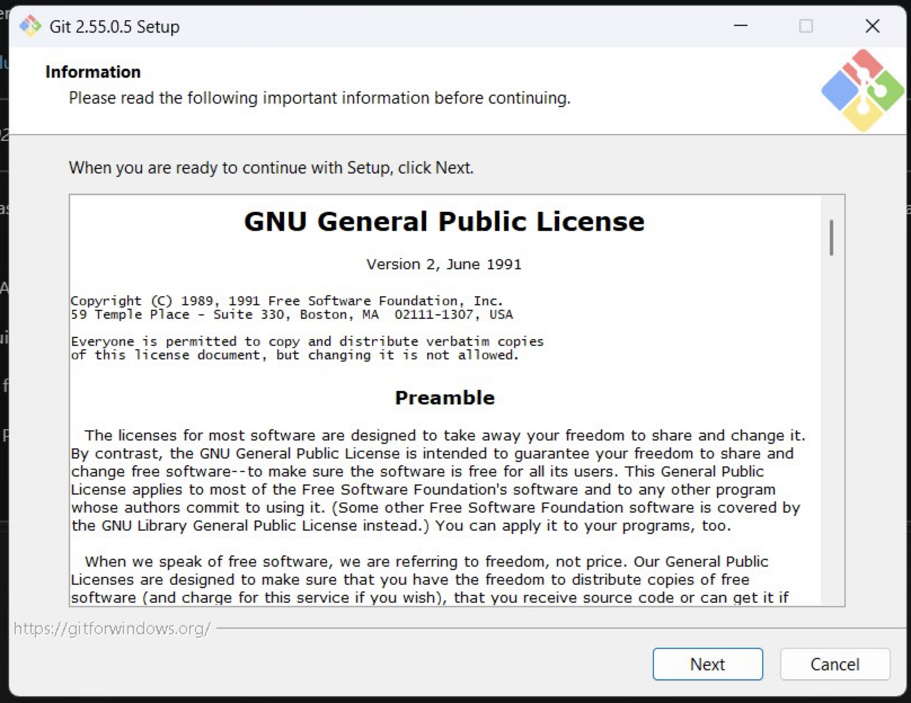
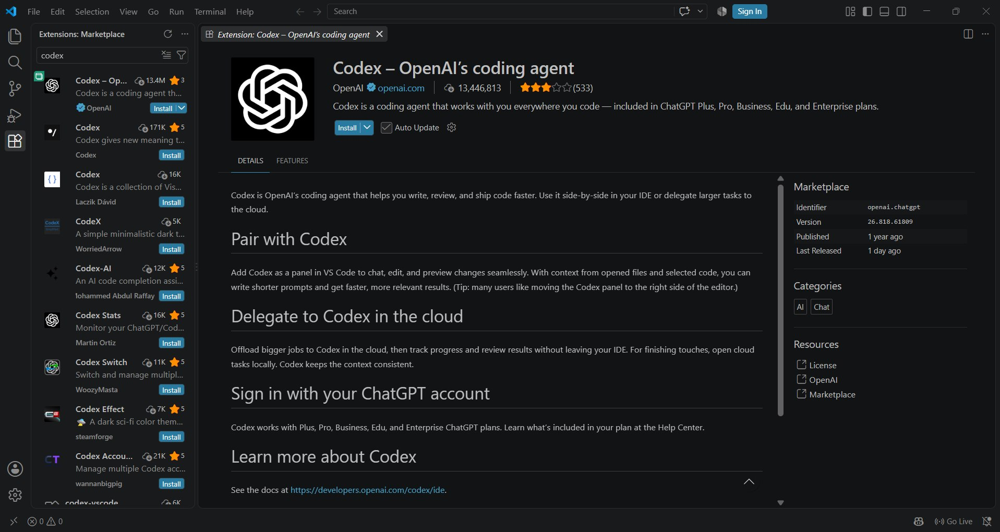
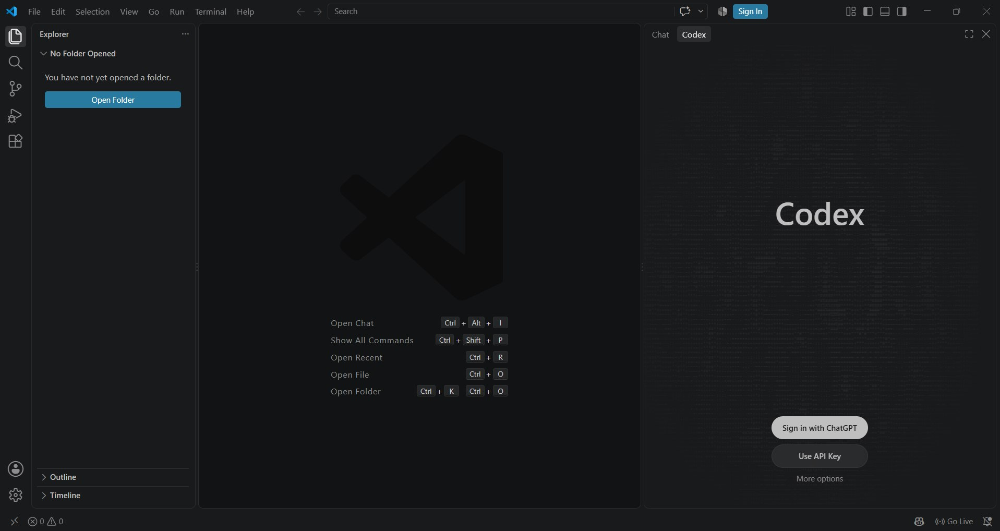
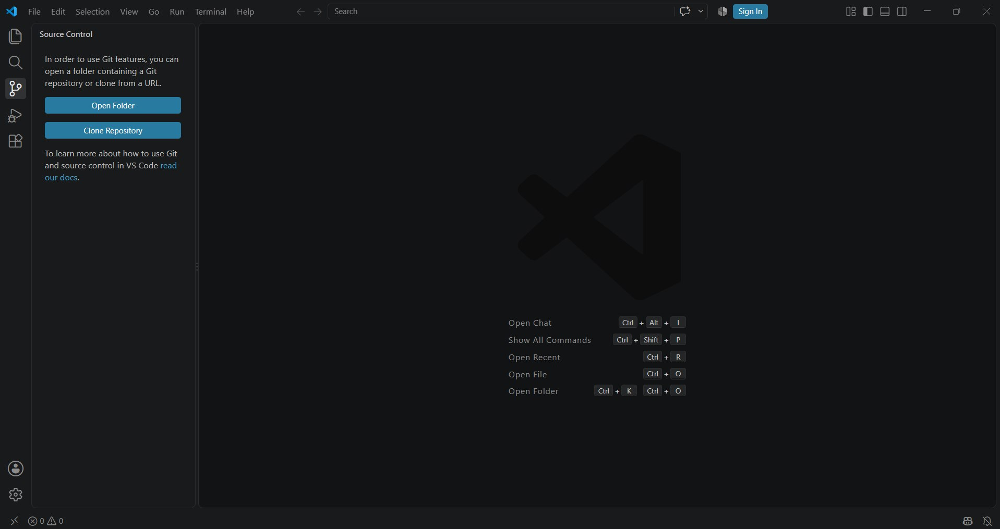
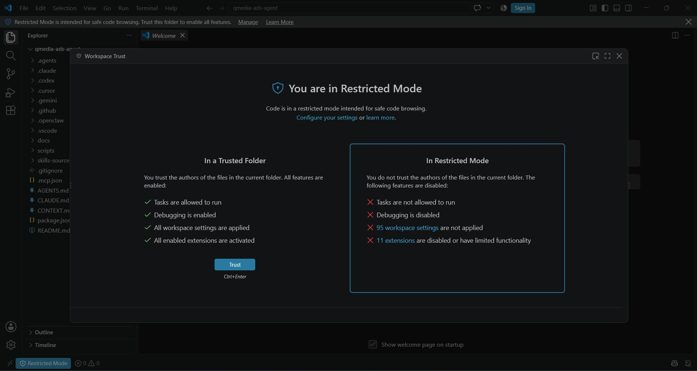
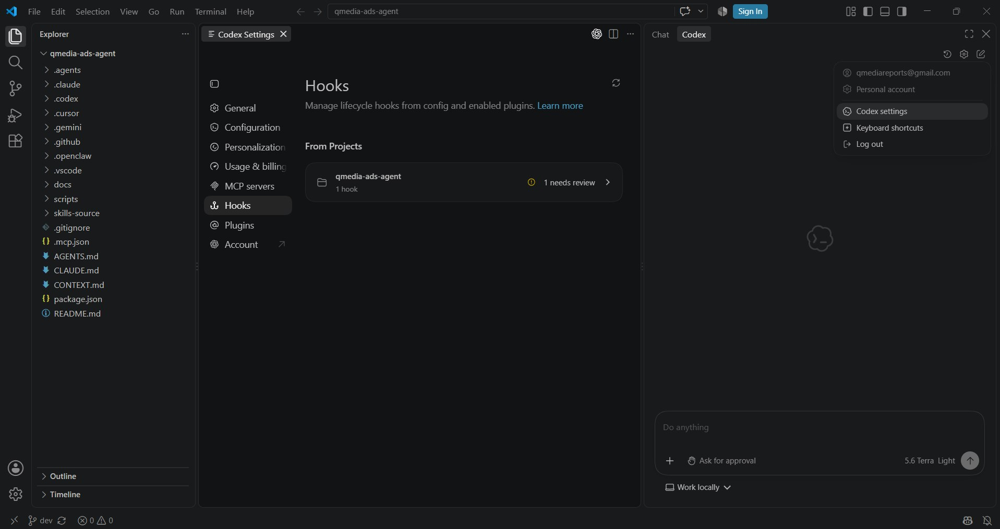
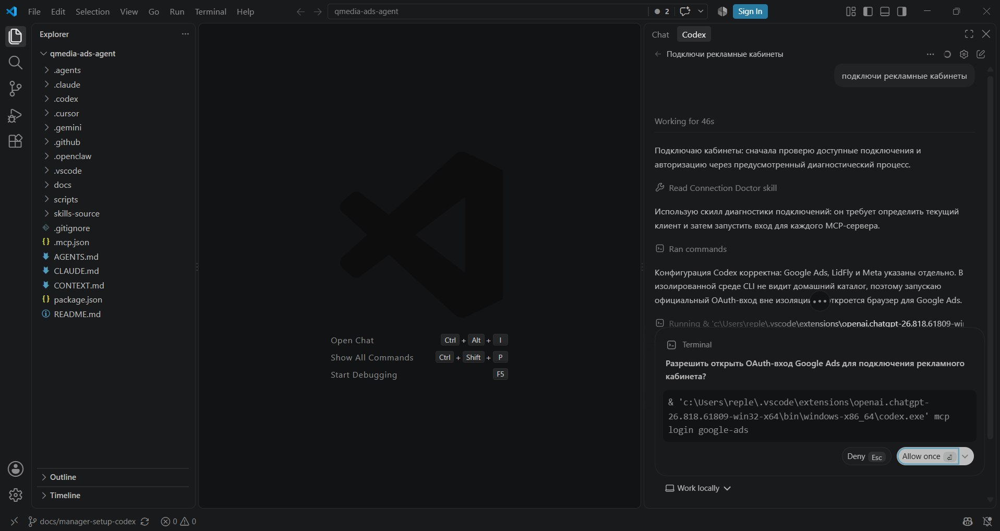
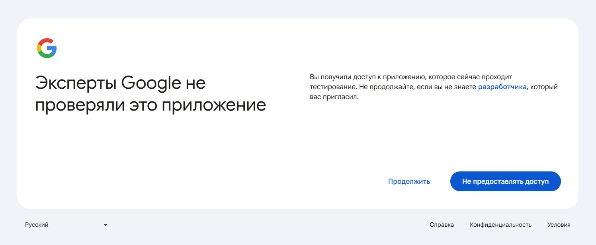
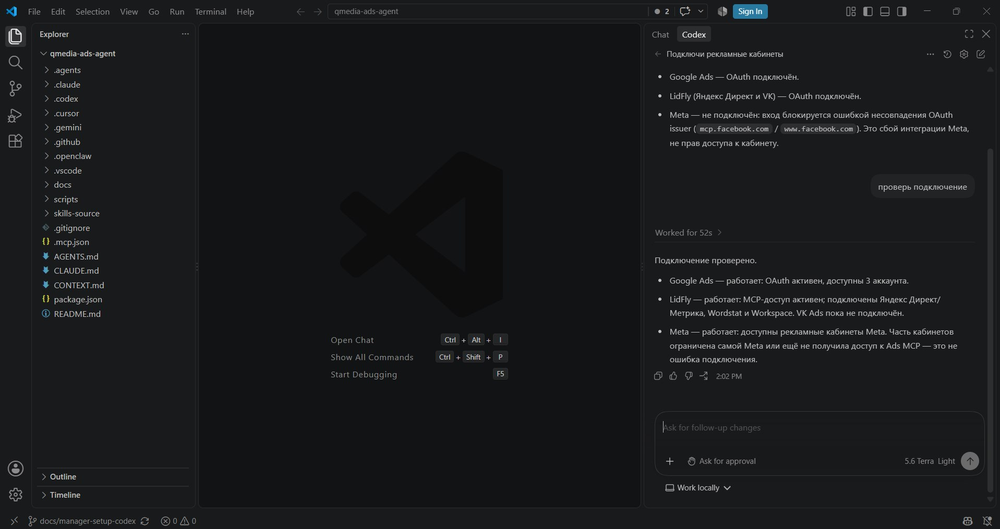

# Настройка

Один раз, примерно полчаса. В конце вы пишете задачу обычным текстом по-русски и получаете результат файлом.

Все названия кнопок здесь — как они выглядят на экране, по-английски. **Русский языковой пакет для VS Code не ставьте**: с ним кнопки называются иначе, и эта инструкция перестанет совпадать с тем, что вы видите.

## Перед началом

Три вещи, без которых дальше идти бессмысленно:

- **Доступ к ChatGPT** — рабочая учётная запись.
- **Ваш рабочий Google-аккаунт внесён в Test users.** Напишите Игорю Спургяшу и дождитесь ответа. Без этого шаг 8 не пройдёт, и обойти его нельзя.
- **Права администратора на компьютере — только для Windows.** Один раз понадобятся на шаге 9. Если на том экране не будет кнопки согласия — напишите Игорю Спургяшу, дальше без него не получится.

---

## 1. Установите VS Code

Скачайте с [code.visualstudio.com](https://code.visualstudio.com/) и установите.

## 2. Установите Git

Скачайте с [git-scm.com/downloads](https://git-scm.com/downloads) и установите, ничего не меняя: во всех окнах жмите **Next**, в последнем — **Install**.



Это программа, которая скачивает и обновляет инструмент. Открывать её никогда не придётся.

## 3. Установите расширение Codex

В VS Code слева — колонка значков. Нажмите **Extensions**, в поиске наберите `Codex`, у расширения **Codex - OpenAI's coding agent** нажмите **Install**.



## 4. Войдите в Codex

Справа под кнопками "Свернуть / Закрыть" появится значок Codex. Нажмите его (или сочетание клавиш `Ctrl + Alt + B`). В правой части VSCode откроется сайдбар с чатом. Жмём **Sign in** — откроется браузер, войдите рабочей учётной записью и вернитесь в VS Code.



## 5. Скачайте папку инструмента

В колонке значков нажмите **Source Control**, затем **Clone Repository**.



В поле сверху вставьте адрес:

```
https://github.com/qmedia-by/qmedia-ads-agent.git
```

Когда спросят, куда сохранить, выберите удобную директорию (например **Documents**). Когда предложат открыть — **Open**.

Если выбрали **Documents**, папка окажется здесь:

- Windows — `C:\Users\<ваше имя>\Documents\qmedia-ads-agent`
- macOS — `Documents/qmedia-ads-agent`

Если потеряете её в VSCode, нажмите: **File → Open Recent**.

## 6. Разрешите Codex работать с папкой

Codex спросит, доверяете ли вы этой папке. Ответьте "Trust" (Да).



## 7. Включите автообновление

Откройте настройки Codex, раздел **Hooks**. Там будет одна строка с пометкой **New hook** — нажмите **Trust**.



> Если такой строки нет, то попробуйте сначала начать новую сессию диалога, написав в чате "Привет"

Включение хука разрешает инструменту обновляться самому. Пропустите шаг — обновления просто не будут приходить, и вы об этом не узнаете.

## 8. Подключите рекламные кабинеты

Откройте чат Codex и напишите:

```text
Подключи рекламные кабинеты
```



Агент по очереди откроет в браузере вход в три сервиса. Ваше дело — пройти вход и вернуться в VS Code:

- 🟠 **Google** — тем самым рабочим аккаунтом, который внесли в Test users.
- 🟢 **LidFly** — вашей учётной записью LidFly.
- 🔴 **Facebook** — обычный вход рабочим аккаунтом.

> 🟠 Подключение к Gogle Ads выдаст что-то вроде "Эксперты Google не проверяли это приложение". Это штатное предупреждение. Жмите продолжить и принимайте всё, что просится дальше.
>
> 

> 🔴 Подключение к аккаунту Facebook (Meta) временно не работает. Агент сам сообщит о проблеме.

Готово, когда агент скажет, что подключены все три. Если он говорит, что какой-то не подключился, — повторите фразу: вход в каждый сервис независим, и заново пройдёт только недостающий.

## 9. Проверьте

Откройте чат Codex и напишите:

```text
Проверь подключение
```



Агент назовёт, что отвечает, а что нет, и даст одно следующее действие. На Windows здесь же в первый раз запросят права администратора — согласитесь.

---

## Что вы увидите по дороге

| Экран | Что это | Что делать |
|---|---|---|
| Google: «Google hasn't verified this app» | наш собственный сервер, Google не проверяет внутренние приложения | **Advanced** → продолжить |
| Запрос прав администратора (только Windows) | Codex один раз настраивает себе безопасную песочницу | согласиться |
| Окно с командой и кнопкой подтверждения | агент просит разрешения выполнить команду | разрешить, и поставить галку «всегда», если она есть |

## Обновления

Инструмент обновляется сам при открытии нового чата. Когда это произошло, агент скажет об этом и попросит открыть **New chat** — правила читаются только в начале чата, поэтому обновление вступает в силу с нового.

Если хотите проверить вручную, напишите в чат:

```text
Обнови инструмент
```

## Дальше

Как ставить задачи, что агент умеет и что делать при ошибках — в [инструкции для Менеджера](./manager-guide.md).
